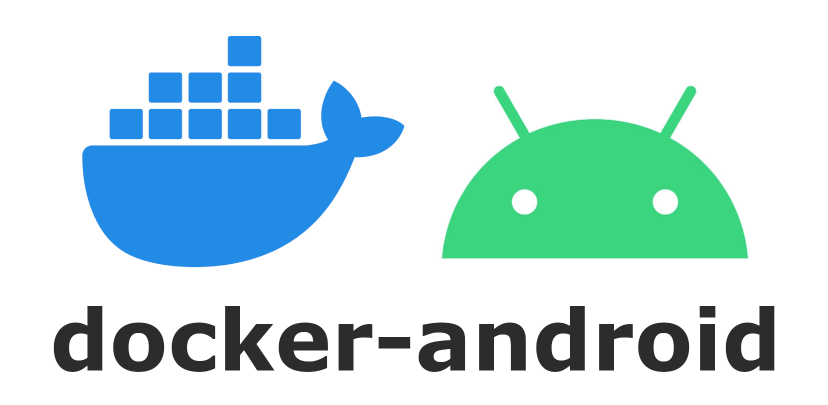

# docker-android



[](https://www.gnu.org/licenses/gpl-3.0)


docker-android provides general purpose docker images to run CI steps of Android project.
Docker allows you to provide a replicable environment, which does not change with the host machine or the CI service.
It should work out of the box on any CI/CD service providing docker support.
The image is providing standard tools to build and test Android application:
* Android SDK (optionally Android NDK)
* [Fastlane first class support](https://github.com/faberNovel/docker-android#fastlane-first-class-support)
* Java JDK
* Google Cloud CLI, to support [Firebase Test Lab](https://firebase.google.com/docs/test-lab)

## CI/CD service support
| CI/CD service | Tested |
| ------------- | ------ |
| [GitHub Actions](https://help.github.com/en/actions) | ✅ |
| [GitLab CI](https://docs.gitlab.com/ee/ci/docker/using_docker_images.html) | ✅ |
| [Circle CI](https://circleci.com/docs/2.0/executor-types/#using-docker) | 🚧 |
| [Travis CI](https://travis-ci.com/) | 🚧 |

## Fastlane first-class support
Images are built to have first class support for Fastlane.
Ruby versions in [`normal maintenance`](https://www.ruby-lang.org/en/downloads/branches/) mode are installed using [rbenv](https://github.com/rbenv/rbenv).
If you are using a Fastlane plugin which requires a native library: 
- Install it using `apt-get update && apt-get -y install <lib>` in your
CI workflow.
- Comment https://github.com/faberNovel/docker-android/issues/78 so that we can
keep track of missing native libraries and add them to the next image version.

## JDK support
Images support multiple JDK, using [Jenv](https://www.jenv.be/).
The default JDK is JDK 11, but JDK 8 is also supported for Android API 30 or lower (use `jenv global 1.8`).
To choose a JDK, make sure the script executes on a bash shell, then use Jenv to set the desired version: 
```
jobs:
  my_android_job:
    defaults:
      run:
        shell: bash

    steps:
      - name: Jenv
        run: |
          eval "$(jenv init -)"
          jenv global {VERSION}

```

## 🐙 GitHub Workflow Sample
Github workflows can run inside Docker images using `container` attribute after `runs-on`:
```yml
name: GitHub Action sample

on:
  push:
    branches:
      - develop

jobs:
  my_android_job:
    runs-on: ubuntu-18.04 # Works also with self hosted runner supporting docker
    container:
      image: docker://fabernovel/android:api-29-v1.1.0

  steps:
    - name: Checkout
      uses: actions/checkout@v2.1.0

    - name: Ruby cache
      uses: actions/cache@v1.2.0
      with:
        path: vendor/bundle
        key: ${{ runner.os }}-gems-${{ hashFiles('**/Gemfile.lock') }}
        restore-keys: |
          ${{ runner.os }}-gems-

    - name: Gradle cache
      uses: actions/cache@v1.2.0
      with:
        path: /root/.gradle
        key: ${{ runner.os }}-gradle-${{ hashFiles('**/*.gradle') }}
        restore-keys: |
          ${{ runner.os }}-gradle

    - name: Bundle install
      run: |
        bundle config path vendor/bundle
        bundle check || bundle install

    - name: Fastlane
      run: bundle exec fastlane my_lane

```
You can also use the provided Github Action.
However, caching won't work and you can expect longer build times.
`docker-android-tag` should be one of the tags found in [Fabernovel Hub Registry Tags](https://hub.docker.com/r/fabernovel/android/tags):
```yml
name: GitHub Action sample

on:
  push:
    branches:
      - develop

jobs:
  my_android_job:
    runs-on: ubuntu-18.04 # Works also with self hosted runner supporting docker

  steps:
    - name: Checkout
      uses: actions/checkout@v2.1.0

    - name: Exec fastlane
      uses: fabernovel/docker-android
      with:
        docker-android-tag: api-29-ndk-v1.1.0
        exec: |
          bundle install;
          bundle exec fastlane my_lane
```

## 📦 Container Registry
docker-android images are hosted on [DockerHub](https://hub.docker.com/repository/docker/fabernovel/android).

## 🔤 Naming
We provide stable and snapshot variants for latest Android API levels, including or not native SDK.
We use the following tagging policy:
`API-NDK-GCLOUD-VERSION`
* `API` the Android API to use, like `api-28`, `api-29`
* `NDK` is the presence or not of the [Android NDK](https://developer.android.com/ndk) in the image
* `GCLOUD` is the presence or not of the [Google Cloud SDK](https://cloud.google.com/sdk) in the image. (the gcloud sdk is needed for Firebase Test Lab for example).
* `VERSION` is the image version. Check [Versions](https://github.com/faberNovel/docker-android/tree/main#versions)

## 🔢 Versions
* `snapshot` versions are build on each push on `develop` branch
* Release versions `v*` on each [GitHub Release](https://github.com/faberNovel/docker-android/releases)

## 📝 Image description
Image description (software and their versions) is provided as [md files](https://github.com/faberNovel/docker-android/tree/main/images_description).

## ✏️ Contributing
Pull requests are welcome. For major changes, please open an issue first to discuss what you would like to change.

You can change image settings via its [Dockerfile](https://github.com/faberNovel/docker-android/blob/main/Dockerfile).
You can build, test, and deploy image using [ci_cd.sh](https://github.com/faberNovel/docker-android/blob/main/ci_cd.sh) script. You need to install docker first.
All scripts must be POSIX compliants.
```sh
usage: ./ci_cd.sh [--android-api 29] [--build-tools "29.0.3"] [--build] [--test]
  --android-api <androidVersion> Use specific Android version from `sdkmanager --list`
  --build-tools <version>        Use specific build tools version
  --android-ndk                  Install Android NDK
  --gcloud                       Install Google Cloud SDK
  --ndk-version <version>        Install a specific Android NDK version from `sdkmanager --list`
  --build                        Build image
  --test                         Test image
  --large-test                   Run large tests on the image (Firebase Test Lab for example)
  --deploy                       Deploy image
  --desc                         Generate a .md file in /desc/ouput folder describing the builded image, on host machine
```

## License
[GNU GPLv3](https://choosealicense.com/licenses/gpl-3.0/)
